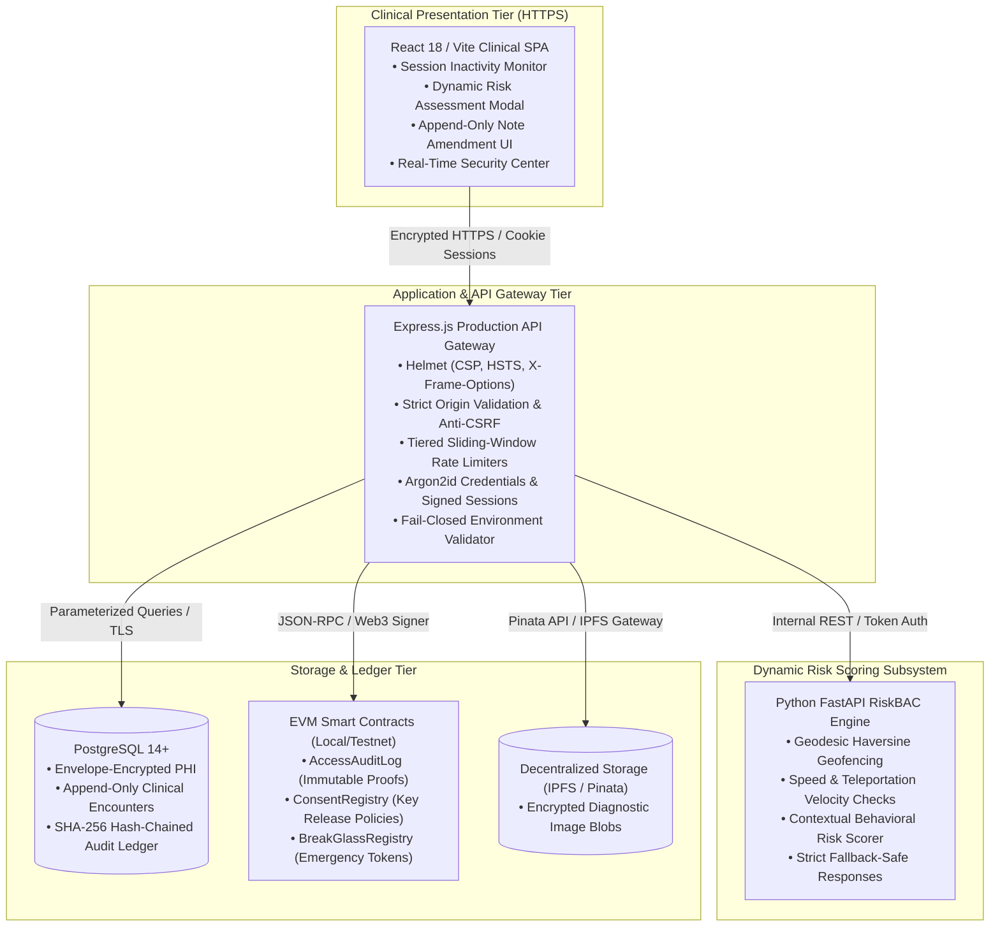
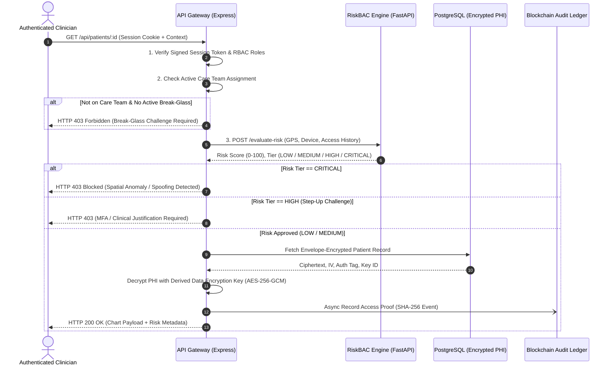

# MedGuard EHR v2.0: Enterprise Zero-Trust Clinical Health Record System

[](#operational-tooling--cli-commands)
[](#security--compliance-framework)
[](#security--compliance-framework)
[](#system-architecture)
[](#system-architecture)

**MedGuard EHR** is a hospital-grade, zero-trust electronic health records (EHR) platform engineered to satisfy **OWASP ASVS Level 2**, the **HIPAA Security Rule**, and enterprise clinical UX standards. It combines deterministic role- and consent-based access controls with dynamic spatial and behavioral risk scoring (RiskBAC), field-level AES-256-GCM envelope encryption, an append-only SHA-256 cryptographic audit chain, and audited on-chain emergency Break-Glass protocols.

---

## Table of Contents

1. [System Architecture](#system-architecture)
2. [Security & Compliance Framework](#security--compliance-framework)
3. [Zero-Trust Access Control & RiskBAC Flow](#zero-trust-access-control--riskbac-flow)
4. [Field-Level Envelope Encryption (AES-256-GCM)](#field-level-envelope-encryption-aes-256-gcm)
5. [Tamper-Evident SHA-256 Audit Trail](#tamper-evident-sha-256-audit-trail)
6. [Emergency Break-Glass Protocol](#emergency-break-glass-protocol)
7. [Repository Structure](#repository-structure)
8. [Quickstart & Development Setup](#quickstart--development-setup)
9. [Operational Tooling & CLI Commands](#operational-tooling--cli-commands)
10. [Test Suites & Verification](#test-suites--verification)
11. [Production Documentation & Runbooks](#production-documentation--runbooks)

---

## System Architecture

MedGuard is composed of four decoupled, security-hardened subsystems:



---

## Security & Compliance Framework

MedGuard was systematically re-engineered from the ground up to satisfy production regulatory and technical baselines:

| Standard / Mandate | Implemented Technical Safeguards |
|:---|:---|
| **OWASP ASVS Level 2** | Fail-closed configuration check, strict CORS origin matching (no wildcards with credentials), parameterized SQL via `pg` driver, Argon2id password hashing with unique salts, tamper-evident sessions, Content Security Policy with nonces. |
| **HIPAA Security Rule § 164.312(a)(1)** | Role-Based Access Control (RBAC), Care Team verification, emergency break-glass procedures with automated expiration and notification dispatch. |
| **HIPAA Security Rule § 164.312(a)(2)(iv)** | Field-level AES-256-GCM envelope encryption protecting Protected Health Information (PHI) at rest, master key rotation tooling. |
| **HIPAA Security Rule § 164.312(b)** | Immutable SHA-256 cryptographic audit chain (`current_hash = SHA256(prev_hash + record)`), automated continuous integrity validation tool (`npm run verify:ledger`). |
| **HIPAA Security Rule § 164.312(c)(1)** | Append-only clinical notes and prescription amendments; modification without revision history is architecturally prevented. |
| **Zero-Trust Principles** | Continuous authentication and contextual authorization; access decisions evaluate doctor identity, care team assignment, location coordinates, temporal shift, and device trust. |

---

## Zero-Trust Access Control & RiskBAC Flow

Every chart access and clinical write undergoes three sequential authorization checkpoints before any plaintext record is returned:



---

## Field-Level Envelope Encryption (AES-256-GCM)

All Sensitive Protected Health Information (SPHI) is encrypted before persistence in PostgreSQL:

- **Algorithm**: Authenticated AES-256-GCM (Galois/Counter Mode) ensuring both confidentiality and cryptographic integrity.
- **Key Derivation**: 256-bit Data Encryption Keys (DEKs) derived using PBKDF2 (100,000 iterations, SHA-512) keyed against `MASTER_ENCRYPTION_KEY`.
- **Envelope Format**:
  ```json
  {
    "__encrypted": true,
    "ciphertext": "a1f8c...6e4d",
    "iv": "3d9f...8a",
    "tag": "e7b1...0c",
    "keyId": "dek-primary-v1",
    "alg": "aes-256-gcm"
  }
  ```
- **Transparent Decryption**: The application layer automatically decrypts authorized reads and encrypts clinical writes without exposing plaintext keys to the database engine.

---

## Tamper-Evident SHA-256 Audit Trail

All access attempts, clinical modifications, consent toggles, and break-glass events are recorded in an append-only cryptographic ledger:

$$\text{Record Hash}_n = \text{SHA256}\left(\text{Record Hash}_{n-1} \,\|\, \text{Timestamp} \,\|\, \text{Actor ID} \,\|\, \text{Action} \,\|\, \text{Resource} \,\|\, \text{Payload Hash}\right)$$

- **Immutability Guarantee**: Any retroactive modification, row deletion, or insertion causes an immediate cryptographic chain break.
- **Verification CLI**: Run `npm run verify:ledger` in CI/CD pipelines or automated cron audits to verify the entire cryptographic chain across every ledger entry.
- **Dual Anchoring**: High-consequence events (break-glass activation, key release) are anchored on-chain to Ethereum EVM contracts (`AccessAuditLog.sol`).

---

## Emergency Break-Glass Protocol

In life-threatening situations where an attending clinician is not on the patient's care team, the system provides a HIPAA-compliant Emergency Break-Glass mechanism:

1. **Mandatory Justification**: The clinician must submit a detailed clinical rationale ($\ge 10$ characters).
2. **Automated Expiry**: Break-glass sessions automatically expire after 4 hours without requiring cron jobs.
3. **Audit Elevation**: Break-glass access triggers immediate high-priority audit alerts, notification webhooks, and on-chain anchoring in `BreakGlassRegistry.sol`.
4. **Post-Incident Review**: Medical directors and compliance officers inspect active and historical break-glass sessions in the Security Center.

*For full operational SOPs and review workflows, refer to [`docs/BREAK_GLASS_RUNBOOK.md`](file:///c:/Users/ASUS/.gemini/antigravity/scratch/Piyumantha/medguard-riskbac/docs/BREAK_GLASS_RUNBOOK.md).*

---

## Repository Structure

```
medguard-riskbac/
├── backend/                        # Node.js / Express Security API Gateway
│   ├── src/
│   │   ├── config/                 # Fail-closed environment validation & security constants
│   │   ├── middleware/             # Rate limiters, RBAC, session guards, correlation tracking
│   │   ├── routes/                 # Clinical, tracking, audit, auth, and break-glass endpoints
│   │   ├── services/               # Encryption, RiskBAC client, audit ledger, DB repository
│   │   └── server.js               # Entrypoint with graceful shutdown & structured logging
│   └── tests/                      # 121 Mocha/Chai integration & security test suites
├── frontend/                       # React 18 / Vite Clinical Frontend
│   ├── src/
│   │   ├── components/             # PatientChart, SecurityCenter, Navigation, TrackingView
│   │   ├── context/                # AuthContext, NotificationContext, WebSocket feed
│   │   └── App.jsx                 # Route protection, idle timeout monitor, design system
│   └── vite.config.js              # Vite bundler configuration with strict CSP headers
├── risk-engine/                    # Python FastAPI Spatial & Behavioral Risk Engine
│   ├── app/
│   │   ├── scoring.py              # Dynamic risk engine combining geofence, velocity & history
│   │   ├── gps_risk.py             # Haversine geofence evaluator & teleportation detector
│   │   └── main.py                 # FastAPI service endpoints
│   └── tests/                      # 11 Pytest unit tests for spatial and scoring algorithms
├── contracts/                      # Hardhat EVM Smart Contracts (Solidity 0.8.24)
│   ├── AccessAuditLog.sol          # Immutable append-only audit log
│   ├── ConsentRegistry.sol         # Decentralized patient consent & key release registry
│   └── BreakGlassRegistry.sol      # Emergency token issuance & expiration contract
├── scripts/                        # Production Administration & Operational CLI Tooling
│   ├── admin-create.js             # Interactive CLI for provisioning initial administrators
│   ├── check-production-clean.js   # Zero-demo cleanliness & forbidden pattern scanner
│   ├── db-migrate.js               # PostgreSQL migration runner
│   ├── db-backup.js                # Encrypted database backup utility
│   ├── db-restore.js               # Point-in-time database restore utility
│   └── verify-audit-chain.js       # SHA-256 cryptographic audit chain verification tool
└── docs/                           # Enterprise Architecture & Deployment Runbooks
    ├── PRODUCTION_DEPLOYMENT_RUNBOOK.md # Production installation, key generation & checklists
    ├── BREAK_GLASS_RUNBOOK.md      # Emergency access protocols & compliance audits
    ├── ARCHITECTURE.md             # Subsystem specifications
    └── RISK_SCORING.md             # Risk scoring mathematical model
```

---

## Quickstart & Development Setup

### 1. Prerequisites
- **Node.js**: v18.17.0 LTS or v20+
- **Python**: v3.10+ (with `venv` and `pip`)
- **PostgreSQL**: v14+ (optional for dev; fallback JSON storage engine enabled by default)
- **Git**

### 2. Install Dependencies
```bash
# Install root Hardhat & operational tools
npm install

# Install backend dependencies
cd backend && npm install && cd ..

# Install frontend dependencies
cd frontend && npm install && cd ..

# Install risk engine dependencies
cd risk-engine
python -m venv venv
# Windows:
venv\Scripts\activate
# Linux/macOS:
source venv/bin/activate
pip install -r requirements.txt
cd ..
```

### 3. Environment Configuration
Copy `.env.example` templates across all services:
```bash
cp .env.example .env
cp backend/.env.example backend/.env
```

Generate secure production secrets:
```bash
# Generate 256-bit Master Encryption Key
node -e "console.log('MASTER_ENCRYPTION_KEY=' + require('crypto').randomBytes(32).toString('hex'))"

# Generate 256-bit JWT Session Secret
node -e "console.log('JWT_SECRET=' + require('crypto').randomBytes(32).toString('hex'))"
```

### 4. Database Setup & Migrations (PostgreSQL)
```bash
# Run schema migrations (creates tables, foreign keys, envelope fields)
npm run db:migrate
```

### 5. Provision System Administrator
```bash
# Provision root administrator account with Argon2id password hash
npm run admin:create
```

### 6. Start Microservices

In separate terminal sessions:

```bash
# 1. Smart Contract Local Node & Deployment
npx hardhat node
npx hardhat run scripts/deploy.js --network localhost

# 2. Risk Engine Service (Port 8000)
cd risk-engine
python -m uvicorn app.main:app --host 127.0.0.1 --port 8000

# 3. Backend API Gateway (Port 5000)
cd backend
npm run dev

# 4. Frontend Clinical UI (Port 5173)
cd frontend
npm run dev
```

Access the clinical application at `http://localhost:5173`.

---

## Operational Tooling & CLI Commands

MedGuard provides enterprise operational scripts for day-to-day administration and security auditing:

| Command | Purpose | Verification Focus |
|:---|:---|:---|
| `npm run check:clean` | Production Cleanliness Scanner | Asserts 0 demo keywords, persona shortcuts, fake bypasses, or debug logs in code. |
| `npm run verify:ledger` | Cryptographic Audit Verifier | Walks the entire SHA-256 audit ledger and verifies cryptographic block continuity. |
| `npm run admin:create` | Administrator Provisioning | Securely provisions root administrator credentials via interactive CLI. |
| `npm run db:migrate` | Database Migration | Executes atomic DDL migrations with rollback support. |
| `npm run db:backup` | Encrypted Backup Utility | Generates compressed, timestamped database dumps. |
| `npm run db:restore` | Disaster Recovery Restore | Restores database state from verified backup snapshots. |

---

## Test Suites & Verification

MedGuard maintains comprehensive test suites across smart contracts, risk algorithms, and backend API routes:

```bash
# Run all core test suites
npm run test:all

# Run Hardhat smart contract tests (10 passing)
npm run test:contracts

# Run Python risk engine tests (11 passing)
npm run test:risk

# Run Backend security & integration tests (121 passing)
npm run test:backend

# Verify frontend production build (Vite bundle generation)
npm run build:frontend

# Run production cleanliness scanner (58 files, 0 violations)
npm run check:clean
```

---

## Production Documentation & Runbooks

For detailed production provisioning, key lifecycle management, disaster recovery procedures, and emergency compliance reviews, refer to the documentation suite in `docs/`:

- [**Production Deployment Runbook**](file:///c:/Users/ASUS/.gemini/antigravity/scratch/Piyumantha/medguard-riskbac/docs/PRODUCTION_DEPLOYMENT_RUNBOOK.md) — Comprehensive guide covering pre-deployment requirements, hardware sizing, environment secrets, zero-downtime deployment steps, monitoring, backup procedures, and go-live checklists.
- [**Emergency Break-Glass Runbook**](file:///c:/Users/ASUS/.gemini/antigravity/scratch/Piyumantha/medguard-riskbac/docs/BREAK_GLASS_RUNBOOK.md) — Standard Operating Procedures for activating, monitoring, and post-audit review of emergency overrides.
- [**Architecture Specification**](file:///c:/Users/ASUS/.gemini/antigravity/scratch/Piyumantha/medguard-riskbac/docs/ARCHITECTURE.md) — Technical deep dive into subsystem decoupling, smart contract interfaces, and zero-trust policy engines.
- [**Risk Scoring Mathematical Model**](file:///c:/Users/ASUS/.gemini/antigravity/scratch/Piyumantha/medguard-riskbac/docs/RISK_SCORING.md) — Mathematical formulations for Haversine geofence calculations, velocity anomaly detection, and composite risk scoring.
- [**Ethics & Location Privacy Separation**](file:///c:/Users/ASUS/.gemini/antigravity/scratch/Piyumantha/medguard-riskbac/docs/ETHICS_LOCATION_SEPARATION.md) — Architectural boundary between clinical EHR records and staff tracking data to preserve employee privacy.

---

## License

This project is licensed under the Apache 2.0 License.
