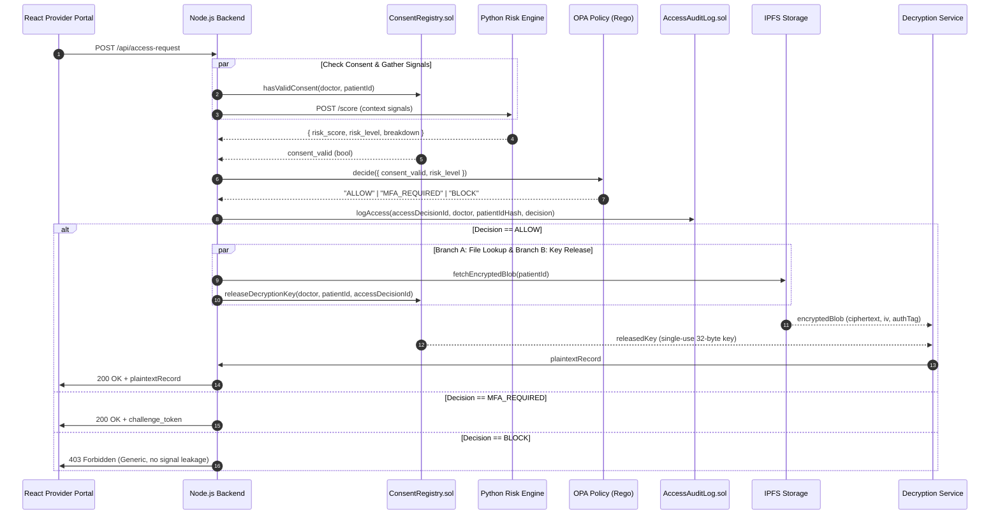

# MedGuard v2 System Architecture & Security Specification

## 1. Architectural Correction from v1

In traditional naive architectures, access control is conflated with key possession: the backend holds a static master decryption key and decrypts files whenever a policy check passes. This violates the core tenet of decentralized Electronic Health Records (EHR): **the backend must never possess standing global decryption authority.**

### The Corrected Two-Branch Decryption Flow
A file hash stored on-chain resolves strictly to an **AES-256-GCM encrypted IPFS blob**. Producing a readable record requires the patient decryption key, which is owned and managed exclusively by the **Dynamic Consent Management (Proxy Re-Encryption)** module.

When RiskBAC generates an `ALLOW` decision, it initiates **two parallel branches**:

---

## 2. Core Modules & Responsibilities

### 1. Smart Contracts Layer (`contracts/`)
* **`IConsentRegistry.sol` / `ConsentRegistry.sol`**:
  * Owns the cryptographic key material and patient authorization policies.
  * `hasValidConsent(address doctor, bytes32 patientId)` verifies consent off-chain and on-chain.
  * `releaseDecryptionKey(...)` releases key material strictly upon receiving an authorized `accessDecisionId` from the backend, emitting an audit event:
    `DecryptionKeyReleased(doctor, patientId, accessDecisionId, key)`.
* **`AccessAuditLog.sol`**:
  * Append-only, tamper-evident ledger recording every access evaluation (`ALLOW`, `MFA_REQUIRED`, `BLOCK`, `BREAK_GLASS`).
  * Never stores medical records, decryption keys, or unhashed identifiers.
* **`BreakGlassRegistry.sol`**:
  * Implements the Red Alert Protocol (RAP).
  * `activateBreakGlass(bytes32 patientId, string justification)` issues a time-boxed emergency token.
  * Constructor enforces maximum duration (30–60 minutes).
  * Auto-invalidates expired tokens at read time without requiring cron triggers.

### 2. Risk Scoring Engine (`risk-engine/`)
* Autonomous microservice exposing `POST /score`.
* Evaluates login time ($R_t$), network geolocation ($R_l$), device fingerprint ($R_d$), and record sensitivity ($R_b$).
* Executes the final blended formula:
  $$R = 0.7 \times \left( \sum w_i R_i \right) + 0.3 \times R_{\max}$$

### 3. Policy Decision Layer (`policy/access_policy.rego`)
* Open Policy Agent (OPA) decoupling business rules from code.
* Strict separation: Python calculates the continuous score, Rego enforces the discrete policy outcome:
  * `consent_valid == false` $\to$ `BLOCK` (overriding any low risk score).
  * `risk_level == "HIGH"` $\to$ `BLOCK`.
  * `consent_valid == true && risk_level == "MEDIUM"` $\to$ `MFA_REQUIRED`.
  * `consent_valid == true && risk_level == "LOW"` $\to$ `ALLOW`.

### 4. Break-Glass Emergency Controller
* Bypasses risk scoring for life-threatening clinical emergencies (unconscious patient, acute trauma).
* Does **not** bypass key custody: emergency access still requests a scoped key release from `ConsentRegistry`, passing the emergency justification as audit context.
* Issues a short-lived, cryptographically signed JWT.
* All actions taken under the emergency session are permanently logged as `isBreakGlass: true`.
