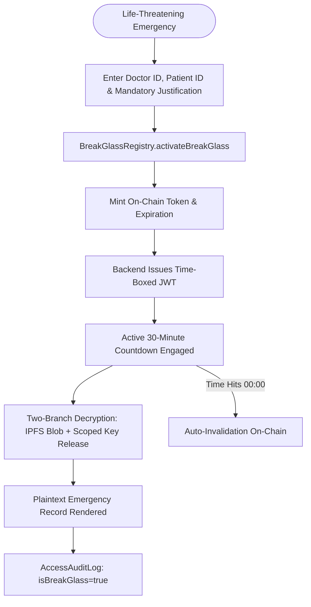

# MedGuard Break-Glass Emergency Operational Runbook (RAP Protocol)

## 1. Purpose & Guiding Principles

The **Red Alert Protocol (RAP)** provides emergency healthcare providers with an immutable, time-boxed mechanism to override normal consent and risk restrictions during life-threatening medical crises without bypassing cryptographic accountability.

### Non-Negotiable Tenets:
1. **Clinical Primacy**: Immediate patient survival supersedes standard consent checks when a patient cannot provide consent.
2. **Cryptographic Custody**: Break-Glass skips risk scoring, **not** key release authorization. Keys must still be requested dynamically from `ConsentRegistry`.
3. **Total Observability**: Every action under an emergency session is permanently recorded on `AccessAuditLog.sol` tagged `isBreakGlass: true`.

---

## 2. Activation Criteria

Clinicians may activate Break-Glass **only** under the following conditions:
* **Unconscious / Incapacitated Patient**: Patient unable to provide consent (e.g., GCS ≤ 8, severe trauma, acute stroke).
* **Acute Anaphylaxis / Cardiac Arrest**: Immediate access to allergy or blood transfusion records is vital to prevent fatal treatment errors.
* **Mass Casualty Incident (MCI)**: Hospital disaster protocol activated by hospital incident command.

*Note: Administrative convenience, routine patient chart reviews, or off-duty inquiries do NOT qualify. Unauthorized overrides result in immediate credential revocation and disciplinary review.*

---

## 3. Operational Workflow

### Step-by-Step Procedure:
1. Navigate to the **Break-Glass Emergency** tab in the Provider Portal.
2. Verify the authorizing **Doctor Ethereum Address** and target **Patient ID**.
3. Enter a mandatory clinical justification of at least **10 characters** (e.g., *"Patient in acute respiratory distress, GCS 4, suspected opioid toxicity, medication allergy check vital"*).
4. Click **Confirm & Activate Break-Glass Emergency**.
5. The smart contract mints a unique `tokenId` with a strict **30-minute time-lock**.
6. Click **Execute Two-Branch Decrypt** to fetch and render the emergency health record.
7. Once clinical care concludes, the token can be revoked early, or allowed to auto-invalidate upon expiration.

---

## 4. Post-Emergency SOC Audit Procedure

Within 24 hours of any Break-Glass activation:
1. **Automated SOC Alert**: Hospital security operations center receives an event alert indexing `BreakGlassActivated` from the blockchain.
2. **Audit Review**:
   * Inspect the `justification` field logged in the smart contract transaction.
   * Cross-reference the timestamp against the Emergency Department (ED) admission log.
   * Verify that the clinician was physically on-duty at the facility during the event.
3. **Discrepancy Investigation**: Any session without corresponding clinical documentation in the hospital EHR triggers an immediate compliance audit.
